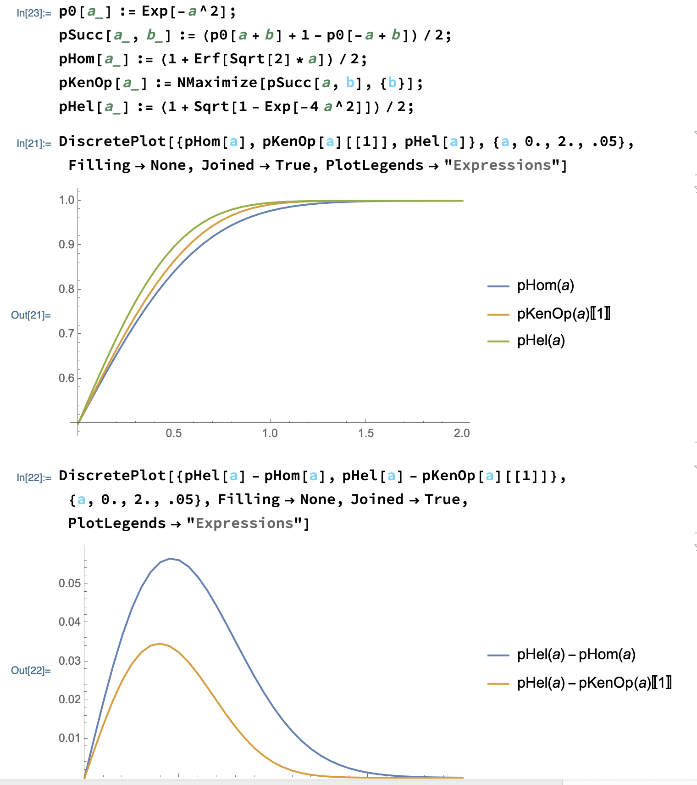

# Coherent State Discrimination

This repository contains the algorithm developed for the article "Optical decoder learning for fiber communication at the quantum limit". 
It consists of: classical code construction, simulation of the quantum circuit, training and testing algorithm, data-collection. 
The aim is to train an optical decoder to maximize the decoding success probability for bit transmission using quantum states of light.

## Objective

Devise a program that can discover good parameter setups within the GPF decoder family for the communication problem at hand. The decoder is a GPF operation that takes as input a multi-mode sequence of coherent states with binary phase modulation, i.e., the quantum codeword, and outputs a guess of the codeword that was initially sent.

## Metrics

We can use at least a couple of metrics:

* error probability = fraction of correctly recovered bits. This can be computed both via the error rate, i.e., running the chosen setup a lot of times for each input codeword and gathering statistics, or via the error probability, i.e., computing directly the average error probability associated to the setup by using the functional expression of the probability distribution of the measurement outcomes.
* information transmission rate =  number of bits correctly recovered per number of uses of the channel (= number of modes = length of the codeword). Also this one can be estimated directly as a rate, by doing several runs, or by computing the mutual information between the random input and the probability distribution of the measurement outcomes.

## Methods

We are going to use the simulation environment provided by Xanadu inc., called PennyLane and StrawberryFields.
The latter simulates a continuous-variable quantum processor. It has different backends: in case you want to perform only Gaussian ops you can use the Gaussian backend, otherwise there are non-Gaussian ones which are slower but can use Tensorflow or other techniques to simulate the whole system.
The former is a platform to compute gradients of quantum circuits and integrate multiple backends: StrawberryFields, TensorFlow, other systems.
You should get familiar with both platforms. Try to understand if we can limit ourselves to use SF, but I don't think so.

## First task

Set up an algorithm that optimizes the error rate and/or information transmission rate for n=4 modes.
The input codewords are all generated by a binary modulation of coherent states on 4 modes: {+a,-a}^4 where a is the square root of the energy of the coherent states, i.e., the amplitude. For example a possible sequence is + a, - a, -a , + a.
At this stage, the GPF decoder should comprise a single layer of the most general Gaussian operation on 4 modes, photodetection on each mode and some kind of classical post-processing of the results that translates the measurement outcomes into a guess, e.g., via a neural network.

## Documentation

1. A description of a [continuous-variable neural network](http://arxiv.org/abs/1806.06871). Do not focus too much on their interpretation, rather on the description of the possible Gaussian operations and on the applications.

2. Whitepapers for [StrawberryFields](http://arxiv.org/abs/1804.03159) and [PennyLane](http://arxiv.org/abs/1811.04968) . This is more a reference for you, not sure how useful it can be in practice. See also the documentation pages online [strawberryfields.ai](http://strawberryfields.ai/) and [https://pennylane.ai](https://pennylane.ai/), where you can also learn from examples.

3. [A paper of ours](http://arxiv.org/abs/2001.10283) where we tried to solve the case of n=1 mode with multiple feedback layers. The methods we employ do not scale up, unfortunately, so for the moment we'll be taking an entirely different route.

4. [A recent paper](https://arxiv.org/pdf/2009.03339.pdf) where they study a single-layer architecture with a larger number of modes, including "ancillary" modes which are used just by the decoder and do not encode prior information.

## Additional Information

See here for a review on Gaussian systems, in particular Sec. III B talks about our problem: [http://arxiv.org/abs/1110.3234](http://arxiv.org/abs/1110.3234)

You can check out our paper for a description of the Dolinar receiver: [https://arxiv.org/abs/2001.10283](https://arxiv.org/abs/2001.10283)

Find the mathematica file and a screenshot where you can take the expressions of the probabilities inside the `doc` folder.



## Running the simulation

There are several ways to run the simulation, all of them are available at the `examples` folder. From all of them, you need first to install the library by running on the project base directory:

```sh
pip install .
```

Then you can execute the `parallel_experiments.py` editing the file and selecting the option you desire to run:

```python
list_number_input_modes = [2]
list_squeezing = [False]
number_ancillas = 0
max_combinations = 0
```

* list_number_input_modes: specify the list of input number of modes.
* list_squeezing: specify if you want to simulate with squeezing layer, True or False. It can be both if you want a simulation for either one.
* number_ancillas: specify the number of ancillas to use
* max_combinations: when using all possible combination of codebooks, specify the number of maximum combinations to train. If you set this parameter to `0`, then it will apply the linear codes technique.

Once your simulation has finished, you should run `process_results.py` to consolidate all your results into a single results `csv` file and plot the results.

Then, you can run the jupyter notebook `plot_testing_results.ipynb` or `plot_testing_best_results.ipynb` that will read from that `csv` file to plot interactive results.
